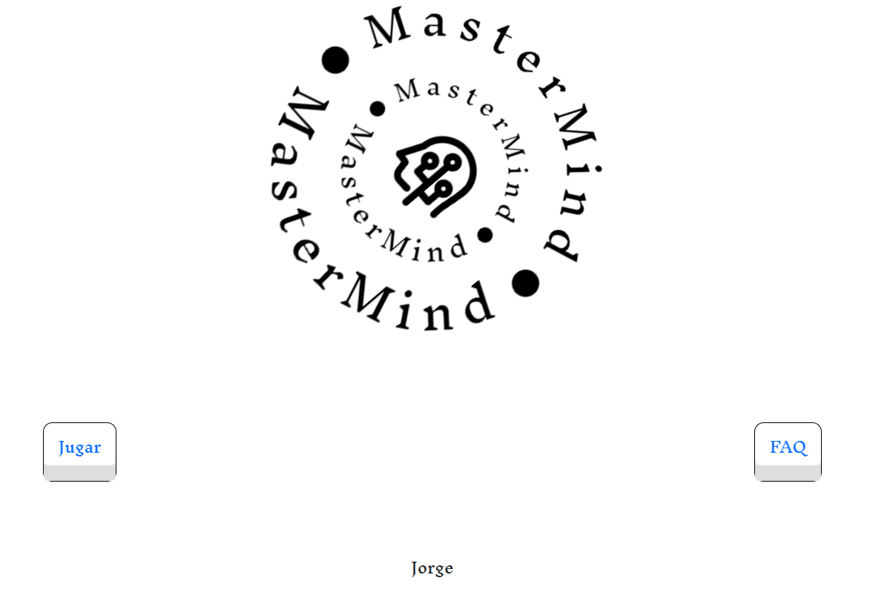
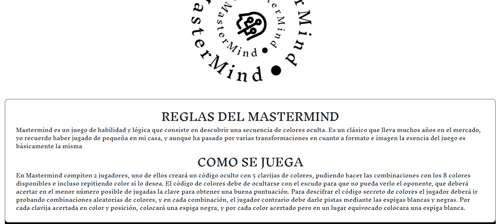
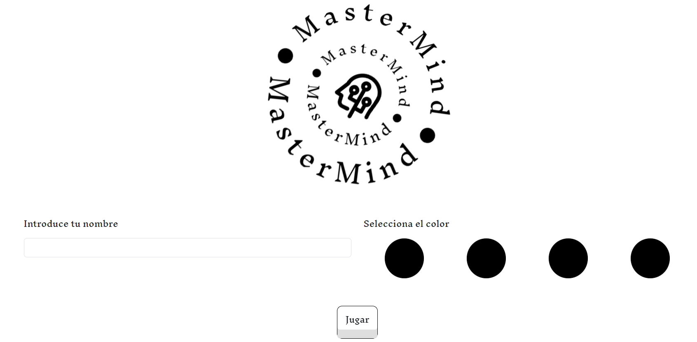
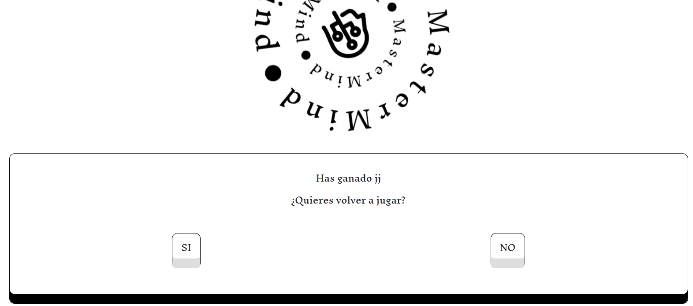
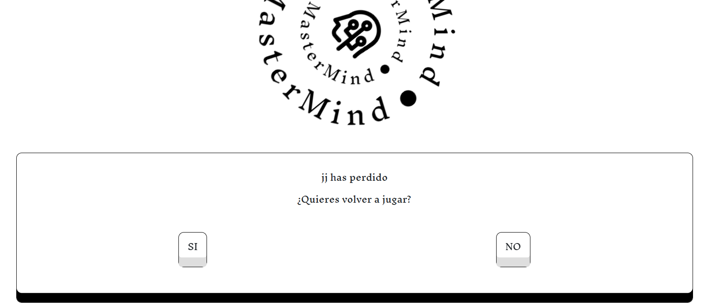

# Mastermind

Es un juego de mesa, de ingenio y reflexión, para dos jugadores.

Se juega en un tablero con fichas blancas y negras pequeñas y de otros colores, de un tamaño algo superior. Uno de los jugadores escoge un número de fichas de colores, 4 en el juego original, y pone un código secreto oculto del otro jugador.

Termina al averiguarse la combinación, o bien se agota el tablero (depende del tamaño, aunque generalmente son 15 combinaciones).

## Construido con 🛠️

* [HTML]
* [CSS]
* [JAVACRIPT] 
* [BOOTSTRAP](https://getbootstrap.com/) - Usado para la estructura base de la web y el responsive

## Deploy 🚀

* Url de [producción](https://jorgelozadev.github.io/mastermind/) 

## Wiki 📖

Ahora te explicaremos como funciona nuestra web.

Home
 

 
Página principal, nos encontraremos 2 botones, "JUGAR" y "FAQ"

FAQ

En esta página te encontrarás las instrucciones para poder jugar a Mastermind

Jugar

En esta página, tienes una caja en la cual se colocara el nombre del jugador y 4 circulos en los cuales tienes que seleccionar los colores con los que quieres jugar y cuando estes listo simplemente dale a jugar

Juego

En esta página se podra ver el nombre del jugador, los colores seleccionados previamente (desordenados), dos botones, un botón de comprobar y otro de borrar. Tambien veras una tabla la cual se ira rellenando segun se haga click en los colores circulares.

Cuando se haga click en alguno de los circulos de colores, este rellenara la caja correspondiente de su fila, esto se repetira hasta que se complete las 4 cajas, cuando hagamos click en el botón de comprobar, se revisara si la selección actual es igual al resultado, si es correcto, se llevara al jugador a la siguiente página, si no lo es, en mitad de las cajas apareceran unos iconos, los cuales indicaran una "X" si el color seleccionado no esta dentro de la opción de resultado, un "?" si el color si esta dentro de la selección, pero ese no es su lugar correspondiente y un "✅", si el color existe y esta en la posición correcta

Resultado

En esta página se mostrar un mensaje, el contenido variara, dependiendo del resultado del juego, en ambos casos, se le preguntara al jugador si quiere jugar otra vez, en el caso de que pulse no, se le llevara a la página de inicio, si pulsa si, volvera al tablero, se le genera una nueva combinación, la cual el jugador tiene que volver a adivinar.

## Autores ✒️

* **Jorge Loza Guzmán** - *Trabajo Inicial* -  *Documentación* - [JorgeLozaDev](https://github.com/JorgeLozaDev)

## Licencia 📄

Este proyecto está bajo la Licencia (LICENSE) - mira el archivo [LICENSE](LICENSE) para detalles

---
⌨️ por [JorgeLozaDev](https://github.com/JorgeLozaDev) 